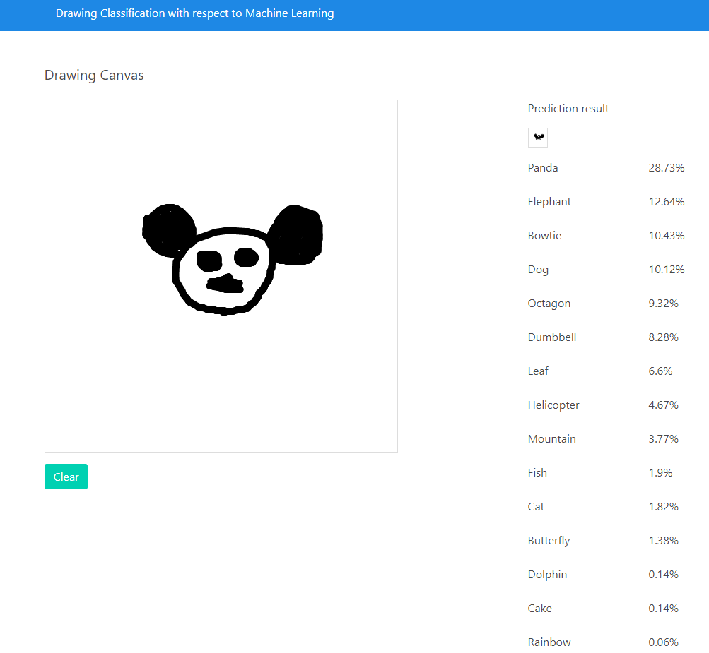
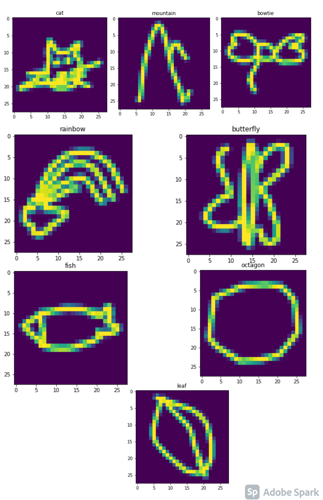
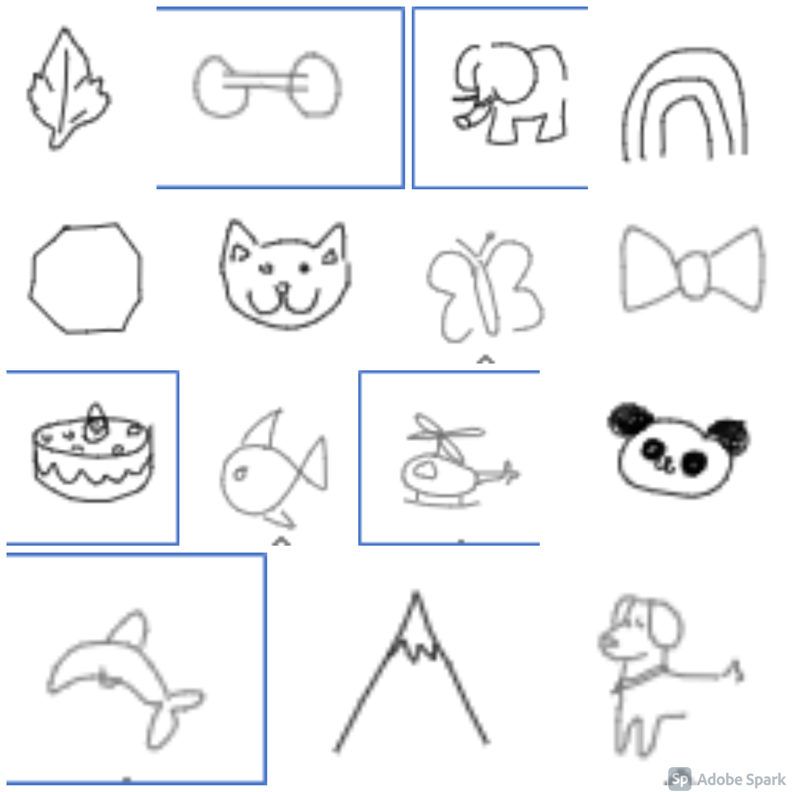

Drawing ML Classifier
===

## Demo

Heroku App: 
[https://drawing-ml.herokuapp.com/](https://drawing-ml.herokuapp.com/)

## Introduction

The object of this project is the classify drawings done on canvas and perform machine learning classification to provide which kind of image is closer of the input.

It is machine learning project to classify [Google Quickdraw image](https://github.com/googlecreativelab/quickdraw-dataset) just 15 classes with convolutional neural networks using [Keras](https://keras.io/) and [Tensorflow](https://www.tensorflow.org). 

Drawing classification

Sample images

